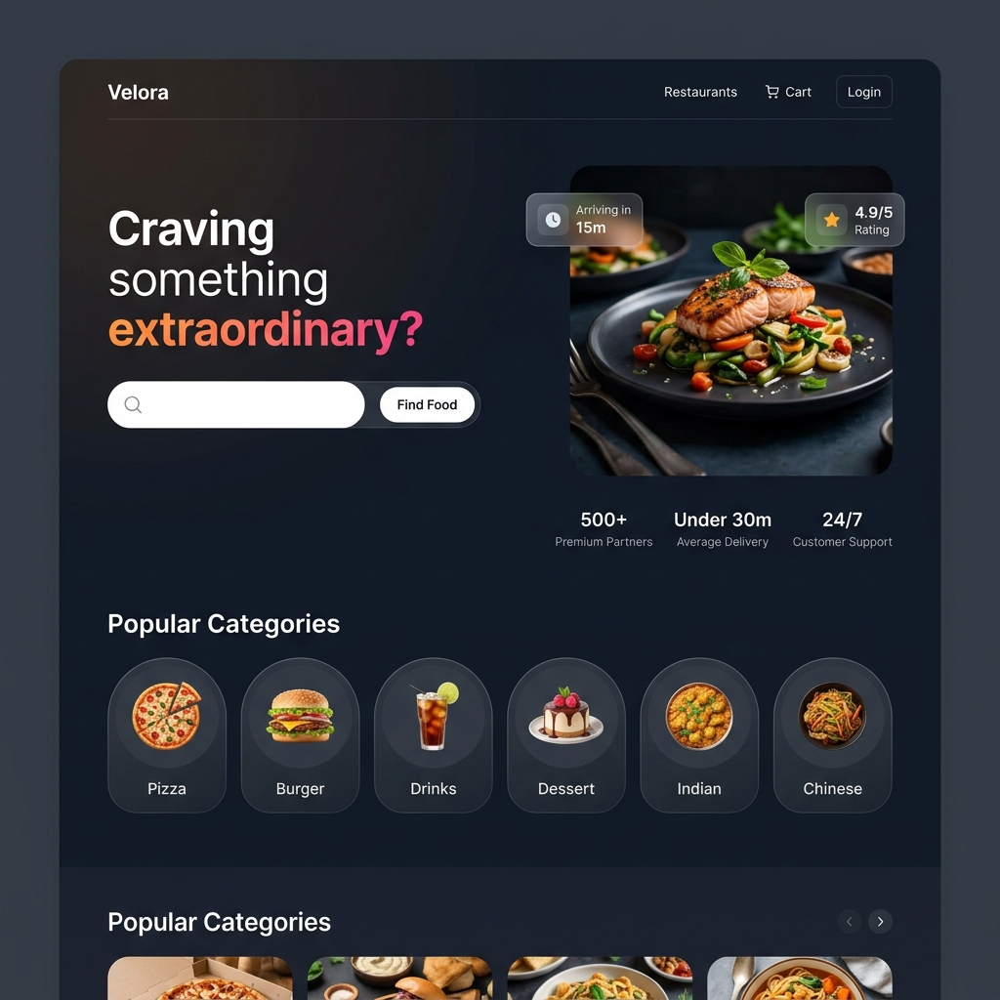
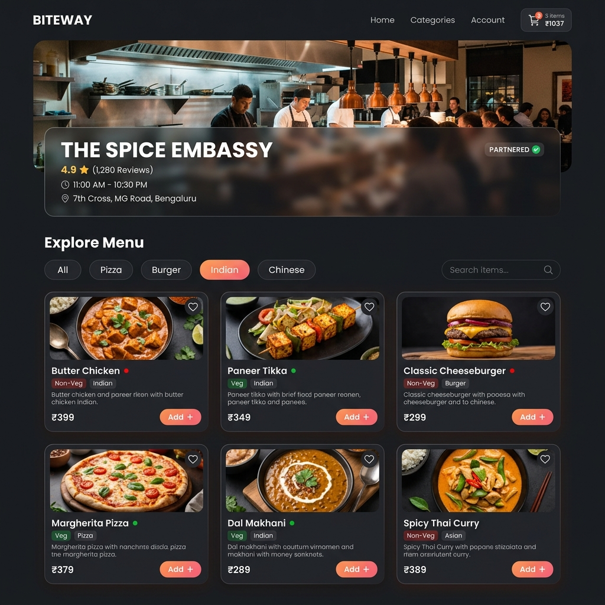
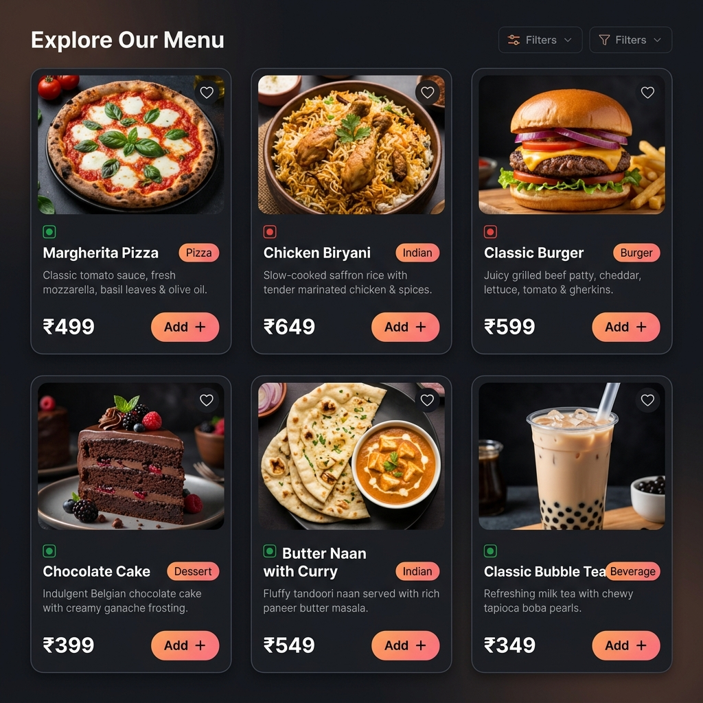
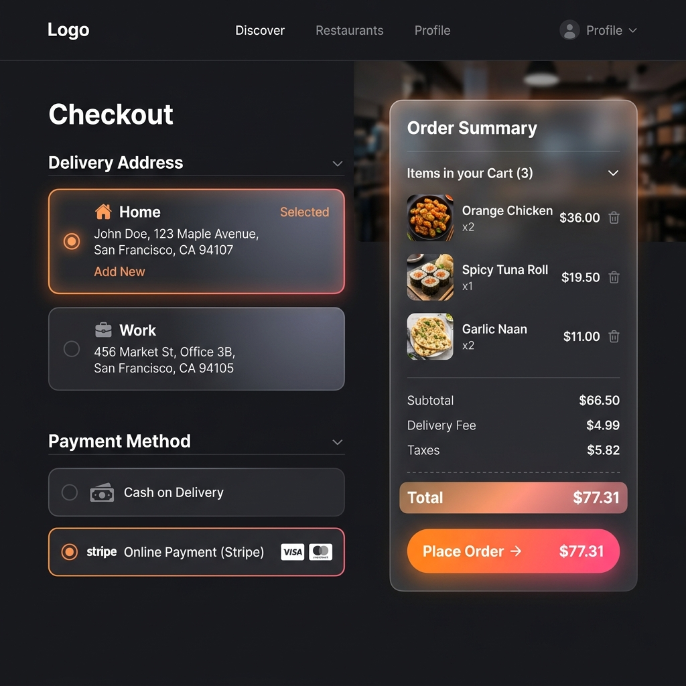
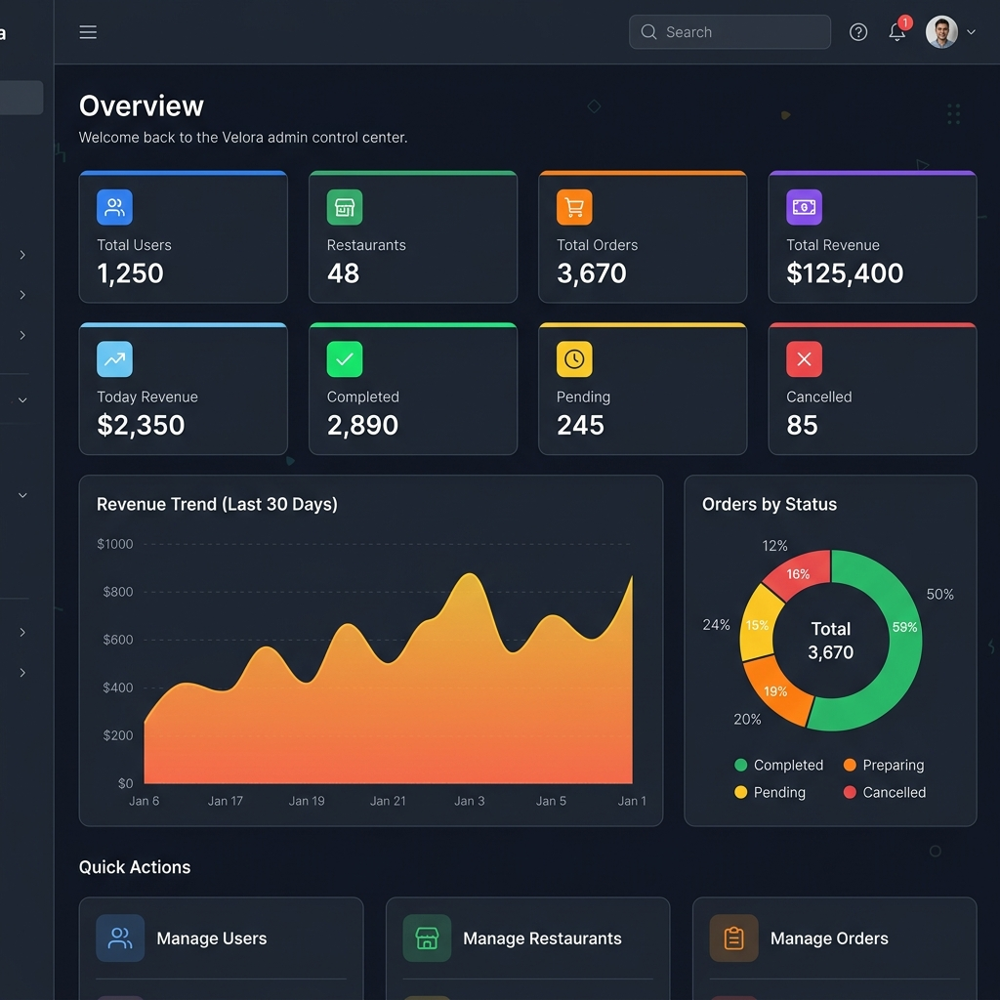

<div align="center">

# 🍽️ Velora — Food Delivery Platform

### A full-stack food delivery web application built with **React**, **Spring Boot**, **PostgreSQL** & **Stripe**

[](https://openjdk.org/)
[](https://spring.io/projects/spring-boot)
[](https://react.dev/)
[](https://www.postgresql.org/)
[](https://stripe.com/)
[](https://vite.dev/)
[](LICENSE)

<br/>

> **Velora** is a production-grade, multi-role food delivery platform featuring a sleek dark-mode UI, real-time cart management, Stripe-powered payments, role-based dashboards (Customer, Restaurant Owner, Admin), and a comprehensive RESTful API backend.

<br/>

</div>

---

## 📸 Screenshots

### 🏠 Homepage

The landing page features a premium hero section with gradient text, glassmorphic floating badges, a smart search bar, popular food categories, featured restaurants, trending foods, and promotional offers.

<p align="center">
  
</p>

---

### 🍕 Restaurant Menu & Food Cards

Browse restaurant menus with category filtering, search functionality, veg/non-veg indicators, wishlist toggling, and one-click add-to-cart. Each food card displays rich details with beautiful imagery.

<p align="center">
  
</p>

<p align="center">
  
</p>

---

### 🛒 Checkout & Payment

A streamlined checkout flow with saved address selection, dual payment methods (Cash on Delivery & Stripe Online Payment), and a glassmorphic order summary with real-time totals.

<p align="center">
  
</p>

---

### 📊 Admin Dashboard

A powerful admin control center with KPI stat cards, revenue trend charts (Recharts), order status pie charts, and quick-action navigation to manage users, restaurants, and orders across the platform.

<p align="center">
  
</p>

---

## ✨ Features

### 👤 Customer Features
- **Smart Search** — Search restaurants and food items with real-time filtering
- **Restaurant Browsing** — View restaurant details, ratings, operating hours, and full menus
- **Category Filtering** — Filter food by 12+ categories (Pizza, Burger, Indian, Chinese, etc.)
- **Cart Management** — Add, update quantity, and remove items with live price calculations
- **Wishlist** — Save favorite food items with one-click heart toggle
- **Multiple Addresses** — Save Home, Work, and Other addresses for quick checkout
- **Dual Payment** — Pay via Cash on Delivery or Stripe online payment (credit/debit cards)
- **Order Tracking** — Track orders through Pending → Confirmed → Preparing → Out for Delivery → Delivered
- **Order History** — View past orders with detailed breakdowns
- **Profile Management** — Update personal information and preferences
- **Dark/Light Theme** — Toggle between dark and light modes with smooth transitions

### 🏪 Restaurant Owner Features
- **Owner Dashboard** — Analytics overview with order stats, revenue metrics, and charts
- **Restaurant Management** — Create and edit restaurant profile, hours, and images
- **Menu Management** — Full CRUD for food items with categories, images, pricing, and availability toggles
- **Order Management** — View and update order statuses (Confirm → Prepare → Dispatch → Deliver)

### 🛡️ Admin Features
- **Platform Dashboard** — Bird's-eye view with 8 KPI stat cards, revenue trend area chart, and order status donut chart
- **User Management** — View all users, filter by role, activate/block/suspend accounts
- **Restaurant Management** — Approve new restaurants, disable problematic ones
- **Order Oversight** — Platform-wide order management with filtering and status tracking
- **Revenue Analytics** — 30-day revenue trend visualization with daily breakdowns

---

## 🏗️ Tech Stack

### Frontend
| Technology | Purpose |
|---|---|
| **React 19** | UI library with hooks and functional components |
| **Vite 8** | Lightning-fast build tool and dev server |
| **Redux Toolkit** | Global state management (auth, cart, orders, wishlist, etc.) |
| **React Router v7** | Client-side routing with lazy loading & code splitting |
| **Axios** | HTTP client for REST API communication |
| **Tailwind CSS 4** | Utility-first CSS framework |
| **Lucide React** | Premium icon library |
| **Recharts** | Data visualization (area charts, pie charts) |
| **React Hook Form** | Performant form handling with validation |
| **React Hot Toast** | Toast notifications |
| **Stripe.js** | Client-side Stripe payment integration |

### Backend
| Technology | Purpose |
|---|---|
| **Java 21** | Language runtime (LTS) |
| **Spring Boot 3.4.5** | Application framework |
| **Spring Security** | Authentication & authorization with JWT |
| **Spring Data JPA** | ORM and database access layer |
| **PostgreSQL** | Relational database |
| **JJWT 0.12.6** | JSON Web Token generation & validation |
| **Stripe Java SDK** | Server-side payment processing |
| **Lombok** | Boilerplate reduction |
| **Bean Validation** | Request DTO validation |
| **Maven** | Build and dependency management |

---

## 📁 Project Structure

```
food-delivery/
├── frontend/                          # React SPA
│   ├── public/
│   │   └── images/                    # Static images (hero, defaults, categories)
│   ├── src/
│   │   ├── api/                       # Axios instance & interceptors
│   │   ├── components/
│   │   │   ├── cards/                 # FoodCard, RestaurantCard, CartItemCard, OrderCard, AddressCard
│   │   │   ├── common/                # Button, LoadingSpinner, SearchBar, EmptyState
│   │   │   ├── layout/                # Navbar, Footer, Sidebar
│   │   │   └── sections/             # HeroSection, PopularCategories, FeaturedRestaurants, TrendingFoods, OffersBanner
│   │   ├── context/                   # ThemeContext (dark/light mode)
│   │   ├── hooks/                     # useAuth, useCart custom hooks
│   │   ├── layouts/                   # MainLayout wrapper
│   │   ├── pages/
│   │   │   ├── auth/                  # LoginPage, RegisterPage
│   │   │   ├── customer/             # HomePage, RestaurantListPage, RestaurantDetailPage, CartPage, CheckoutPage, OrdersPage, OrderDetailPage, ProfilePage, AddressesPage, WishlistPage, PaymentSuccessPage, PaymentCancelPage
│   │   │   ├── owner/                # OwnerDashboard, OwnerRestaurant, OwnerMenu, OwnerOrders
│   │   │   ├── admin/                # AdminDashboard, AdminUsers, AdminRestaurants, AdminOrders
│   │   │   └── errors/               # NotFoundPage, UnauthorizedPage
│   │   ├── routes/                    # AppRoutes, ProtectedRoute, RoleRoute
│   │   ├── services/                  # paymentService (Stripe integration)
│   │   ├── store/
│   │   │   ├── slices/               # Redux slices (auth, cart, food, restaurant, order, wishlist, address, admin)
│   │   │   └── index.js              # Store configuration
│   │   ├── utils/                     # constants, formatters
│   │   ├── App.jsx                    # Root component
│   │   ├── main.jsx                   # Entry point
│   │   └── index.css                  # Global styles & design tokens
│   ├── package.json
│   └── vite.config.js
│
├── backend/                           # Spring Boot API
│   └── src/main/java/com/fooddelivery/
│       ├── FoodDeliveryApplication.java
│       ├── config/                    # CORS, Security, Stripe configuration
│       ├── controller/               # REST controllers (12 controllers)
│       │   ├── AuthController         # Login, Register
│       │   ├── RestaurantController   # CRUD restaurants
│       │   ├── FoodItemController     # CRUD food items
│       │   ├── CartController         # Cart operations
│       │   ├── OrderController        # Order lifecycle
│       │   ├── PaymentController      # Stripe checkout sessions & webhooks
│       │   ├── AddressController      # Address CRUD
│       │   ├── ReviewController       # Restaurant reviews
│       │   ├── WishlistController     # Wishlist toggle
│       │   ├── SearchController       # Search restaurants & food
│       │   └── AdminController        # Admin dashboard & management
│       ├── dto/                       # Request/Response DTOs
│       ├── entity/                    # JPA entities (18 entities)
│       │   ├── User, Role, AccountStatus
│       │   ├── Restaurant, FoodItem, Category
│       │   ├── Cart, CartItem
│       │   ├── Order, OrderItem, OrderStatus
│       │   ├── Payment, PaymentMethod, PaymentStatus
│       │   ├── Address, AddressType
│       │   ├── Review, Wishlist
│       ├── exception/                 # Global exception handling
│       ├── repository/                # Spring Data JPA repositories
│       ├── security/                  # JWT filter, UserDetails, SecurityConfig
│       └── service/                   # Business logic layer
│
├── docs/
│   └── screenshots/                   # README screenshot assets
└── README.md
```

---

## 🚀 Getting Started

### Prerequisites

| Tool | Version | Required |
|---|---|---|
| **Java JDK** | 21+ | ✅ |
| **Node.js** | 18+ | ✅ |
| **PostgreSQL** | 14+ | ✅ |
| **Maven** | 3.8+ | ✅ |
| **Stripe Account** | — | ✅ (for payments) |

### 1. Clone the Repository

```bash
git clone https://github.com/yourusername/food-delivery.git
cd food-delivery
```

### 🐳 Run with Docker & Docker Compose (Recommended)

The easiest way to run the entire stack (PostgreSQL database, Spring Boot API, and React frontend) is using Docker Compose:

1. **Configure Environment Variables**  
   Copy the example environment file and fill in your Stripe API keys:
   ```bash
   cp .env.example .env
   ```

2. **Start the Stack**  
   Run the following command to build and run all services:
   ```bash
   docker compose up --build
   ```

3. **Access the Application**  
   - **Frontend UI:** [http://localhost](http://localhost) (Nginx serving on port 80)
   - **Backend API:** [http://localhost:8080](http://localhost:8080)
   - **PostgreSQL Database:** Port `5432` on host

---

### 🛠️ Manual Development Setup


### 2. Database Setup

Create a PostgreSQL database:

```sql
CREATE DATABASE food_delivery_db;
```

### 3. Backend Configuration

Update `backend/src/main/resources/application.properties` or set environment variables:

```properties
# Database
DB_USERNAME=postgres
DB_PASSWORD=your_password

# JWT Secret (min 256 bits)
JWT_SECRET=your_super_secret_key_here

# Stripe Keys (from https://dashboard.stripe.com/apikeys)
STRIPE_SECRET_KEY=sk_test_...
STRIPE_PUBLISHABLE_KEY=pk_test_...
STRIPE_WEBHOOK_SECRET=whsec_...
```

### 4. Start the Backend

```bash
cd backend
./mvnw spring-boot:run
```

The API server starts at `http://localhost:8080`.

### 5. Start the Frontend

```bash
cd frontend
npm install
npm run dev
```

The app opens at `http://localhost:5173`.

---

## 🔐 Authentication & Authorization

The platform uses **JWT (JSON Web Token)** based authentication with role-based access control:

| Role | Access Level |
|---|---|
| `CUSTOMER` | Browse, order, cart, wishlist, reviews, profile |
| `RESTAURANT_OWNER` | Manage own restaurant, menu items, process orders |
| `ADMIN` | Full platform control — users, restaurants, orders, analytics |

**Auth Flow:**
1. User registers with name, email, password, and selected role
2. On login, the server issues a JWT token (24h expiry)
3. Token is stored in `localStorage` and attached to all API requests via Axios interceptor
4. Protected routes check authentication + role before rendering

---

## 💳 Payment Integration

Velora integrates **Stripe Checkout** for secure online payments:

1. Customer selects "Online Payment" at checkout
2. Backend creates a Stripe Checkout Session with order details
3. Customer is redirected to Stripe's hosted payment page
4. On success, Stripe webhook notifies the backend to update payment status
5. Customer is redirected to the success page with order confirmation

**Supported Payment Methods:**
- 💵 Cash on Delivery
- 💳 Online Payment (Stripe — Credit/Debit Cards)

---

## 🗃️ API Endpoints

### Authentication
| Method | Endpoint | Description |
|---|---|---|
| `POST` | `/api/auth/register` | Register new user |
| `POST` | `/api/auth/login` | Login & receive JWT |

### Restaurants
| Method | Endpoint | Description |
|---|---|---|
| `GET` | `/api/restaurants` | List all restaurants |
| `GET` | `/api/restaurants/{id}` | Get restaurant details |
| `POST` | `/api/restaurants` | Create restaurant (Owner) |
| `PUT` | `/api/restaurants/{id}` | Update restaurant (Owner) |

### Food Items
| Method | Endpoint | Description |
|---|---|---|
| `GET` | `/api/food-items/restaurant/{id}` | Get menu by restaurant |
| `POST` | `/api/food-items` | Add food item (Owner) |
| `PUT` | `/api/food-items/{id}` | Update food item (Owner) |
| `DELETE` | `/api/food-items/{id}` | Delete food item (Owner) |

### Cart
| Method | Endpoint | Description |
|---|---|---|
| `GET` | `/api/cart` | Get current cart |
| `POST` | `/api/cart/items` | Add item to cart |
| `PUT` | `/api/cart/items/{id}` | Update cart item quantity |
| `DELETE` | `/api/cart/items/{id}` | Remove cart item |
| `DELETE` | `/api/cart` | Clear entire cart |

### Orders
| Method | Endpoint | Description |
|---|---|---|
| `POST` | `/api/orders` | Place new order |
| `GET` | `/api/orders` | Get user's orders |
| `GET` | `/api/orders/{id}` | Get order details |
| `PUT` | `/api/orders/{id}/status` | Update order status |
| `PUT` | `/api/orders/{id}/cancel` | Cancel order |

### Payments
| Method | Endpoint | Description |
|---|---|---|
| `POST` | `/api/payments/checkout-session` | Create Stripe session |
| `POST` | `/api/payments/webhook` | Stripe webhook handler |

### Search
| Method | Endpoint | Description |
|---|---|---|
| `GET` | `/api/search/restaurants` | Search restaurants |
| `GET` | `/api/search/food-items` | Search food items |

### Admin
| Method | Endpoint | Description |
|---|---|---|
| `GET` | `/api/admin/dashboard` | Dashboard statistics |
| `GET` | `/api/admin/users` | List all users |
| `PUT` | `/api/admin/users/{id}/status` | Update user account status |
| `GET` | `/api/admin/orders/analytics` | Order analytics |
| `GET` | `/api/admin/revenue/analytics` | Revenue analytics |

---

## 🎨 Design System

Velora uses a custom **CSS design token system** with support for dark and light themes:

- **Color Palette** — Primary (orange), Secondary (pink), Accent, Surface, Background
- **Typography** — Inter font family with multiple weight scales
- **Shadows** — 5 elevation levels (sm, md, lg, xl, glow)
- **Glassmorphism** — Frosted glass effects on cards and overlays
- **Animations** — Fade-in, slide-up, pulse, and stagger effects
- **Responsive** — Mobile-first design with breakpoints at sm/md/lg/xl

---

## 🧪 Development

```bash
# Run frontend in development mode
cd frontend && npm run dev

# Run backend in development mode  
cd backend && ./mvnw spring-boot:run

# Build frontend for production
cd frontend && npm run build

# Build backend JAR
cd backend && ./mvnw clean package
```

---

## 📄 Environment Variables

| Variable | Description | Default |
|---|---|---|
| `DB_USERNAME` | PostgreSQL username | `postgres` |
| `DB_PASSWORD` | PostgreSQL password | `postgres` |
| `JWT_SECRET` | JWT signing secret (256-bit min) | Built-in dev key |
| `JWT_EXPIRATION_MS` | Token expiry in milliseconds | `86400000` (24h) |
| `STRIPE_SECRET_KEY` | Stripe secret API key | — |
| `STRIPE_PUBLISHABLE_KEY` | Stripe publishable key | — |
| `STRIPE_WEBHOOK_SECRET` | Stripe webhook signing secret | — |
| `VITE_API_URL` | Backend API URL for frontend | `""` (proxy) |
| `VITE_STRIPE_PUBLIC_KEY` | Stripe public key for frontend | — |

---

## 🤝 Contributing

1. Fork the repository
2. Create your feature branch (`git checkout -b feature/amazing-feature`)
3. Commit your changes (`git commit -m 'Add some amazing feature'`)
4. Push to the branch (`git push origin feature/amazing-feature`)
5. Open a Pull Request

---

## 📜 License

This project is licensed under the **MIT License** — see the [LICENSE](LICENSE) file for details.

---

<div align="center">

**Built with ❤️ using React, Spring Boot & PostgreSQL**

⭐ Star this repo if you found it useful!

</div>

